# TB Suite - Technical Architecture

## 🏗️ System Architecture Overview

The TB Suite follows a modular, microservices-inspired architecture while leveraging the monolithic benefits of Frappe Framework.

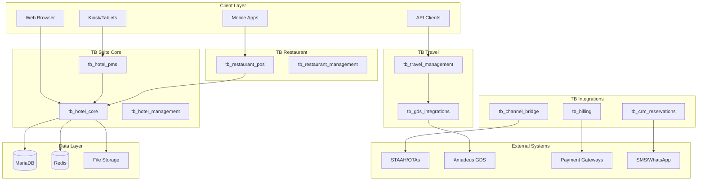

## 📦 Module Architecture

### Core Modules Hierarchy

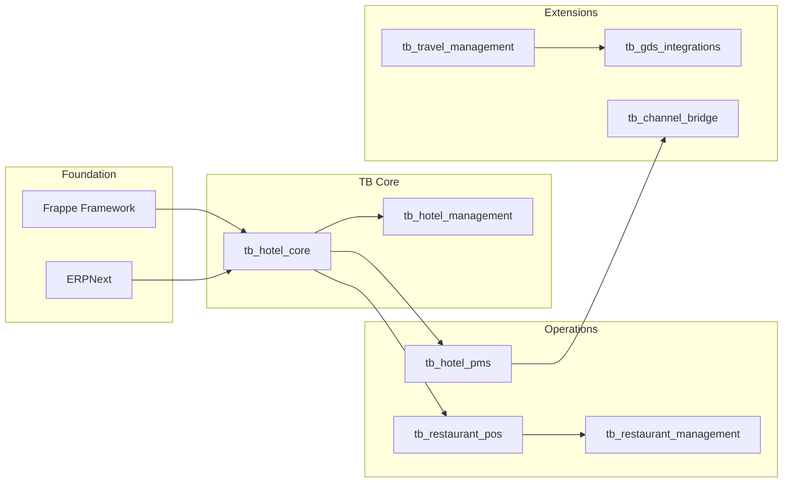

### Module Dependencies

| Module | Depends On | Required For |
|--------|------------|--------------|
| **tb_hotel_core** | frappe, erpnext | All TB modules |
| **tb_hotel_management** | tb_hotel_core | Multi-property operations |
| **tb_hotel_pms** | tb_hotel_core, tb_hotel_management | Front desk operations |
| **tb_restaurant_pos** | tb_hotel_core | Restaurant operations |
| **tb_restaurant_management** | tb_restaurant_pos | F&B management |
| **tb_travel_management** | tb_hotel_core | Travel bookings |
| **tb_gds_integrations** | tb_travel_management | GDS connectivity |
| **tb_channel_bridge** | tb_hotel_pms | OTA integration |
| **tb_billing** | tb_hotel_core | Invoicing |
| **tb_crm_reservations** | tb_hotel_core | CRM features |

## 🔄 Data Flow Architecture

### PMS Operational Flow

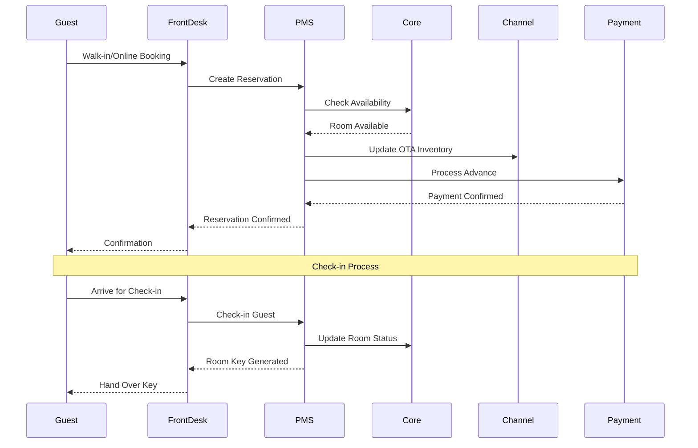

### Restaurant POS Flow

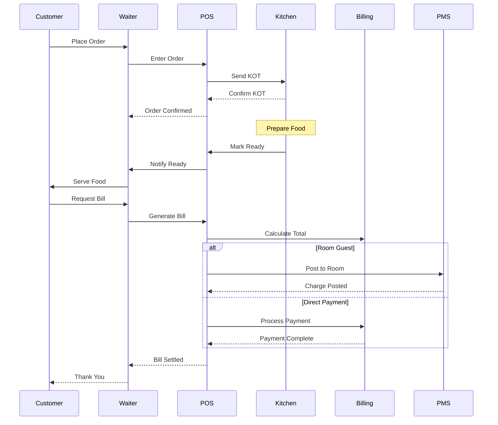

### Travel Booking with GDS

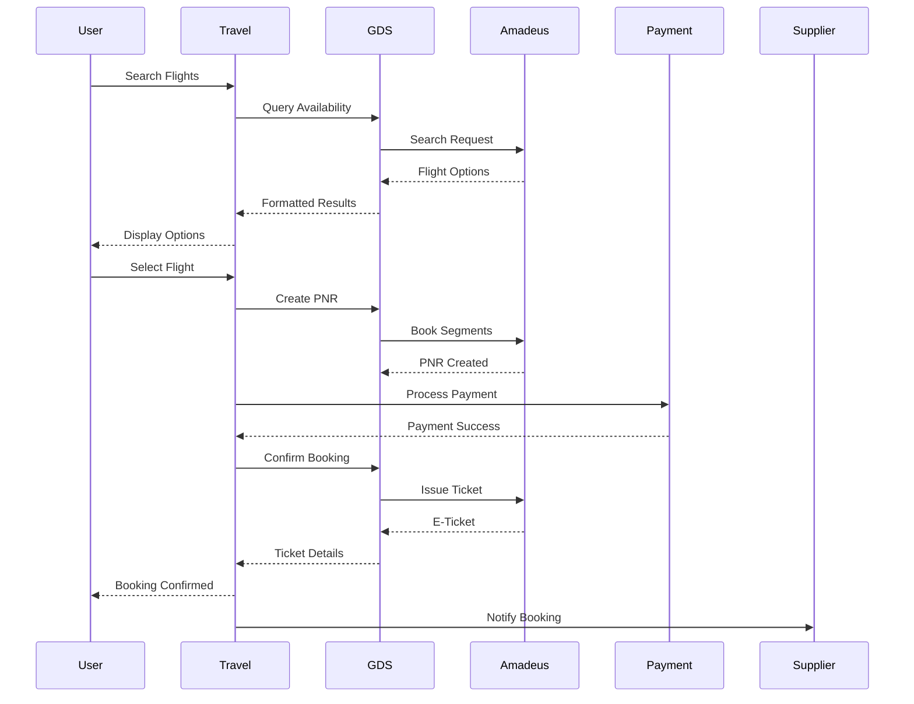

## 💾 Data Architecture

### Core Entity Model

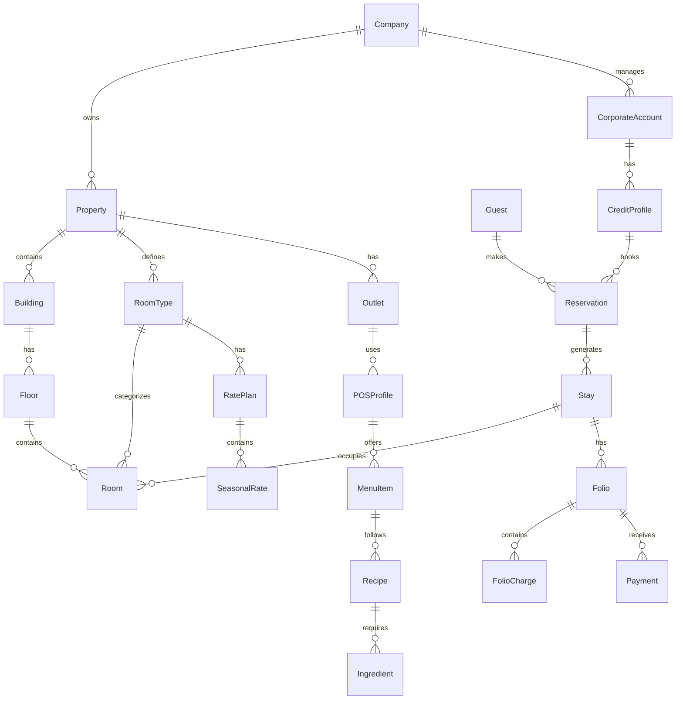

### Multi-Company Architecture

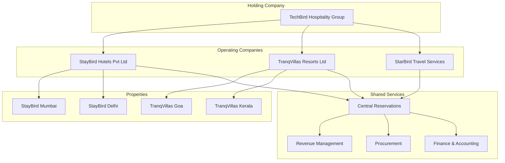

## 🔌 Integration Architecture

### Provider Interface Pattern

All external integrations follow a standardized provider interface pattern:

```python
# Base Provider Interface
class BaseProvider:
    def authenticate(self) -> bool:
        """Authenticate with provider"""
        pass
    
    def validate_config(self) -> bool:
        """Validate configuration"""
        pass
    
    def handle_webhook(self, payload: dict) -> dict:
        """Process webhook from provider"""
        pass
    
    def get_status(self) -> dict:
        """Get provider connection status"""
        pass

# Channel Manager Provider
class ChannelProvider(BaseProvider):
    def sync_inventory(self, property_id: str, date_range: tuple) -> bool:
        """Push inventory to channels"""
        pass
    
    def fetch_bookings(self, last_sync: datetime) -> list:
        """Pull new bookings"""
        pass
    
    def update_rates(self, rate_updates: list) -> bool:
        """Update rate plans"""
        pass

# GDS Provider
class GDSProvider(BaseProvider):
    def search_availability(self, criteria: dict) -> list:
        """Search for availability"""
        pass
    
    def create_booking(self, booking_data: dict) -> str:
        """Create PNR/booking"""
        pass
    
    def issue_ticket(self, pnr: str) -> dict:
        """Issue ticket/voucher"""
        pass
```

### Integration Points

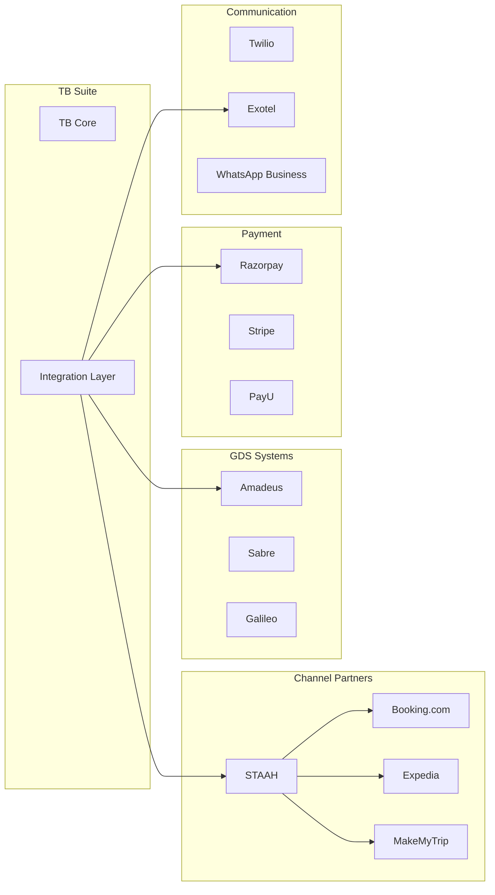

## 🔐 Security Architecture

### Authentication & Authorization

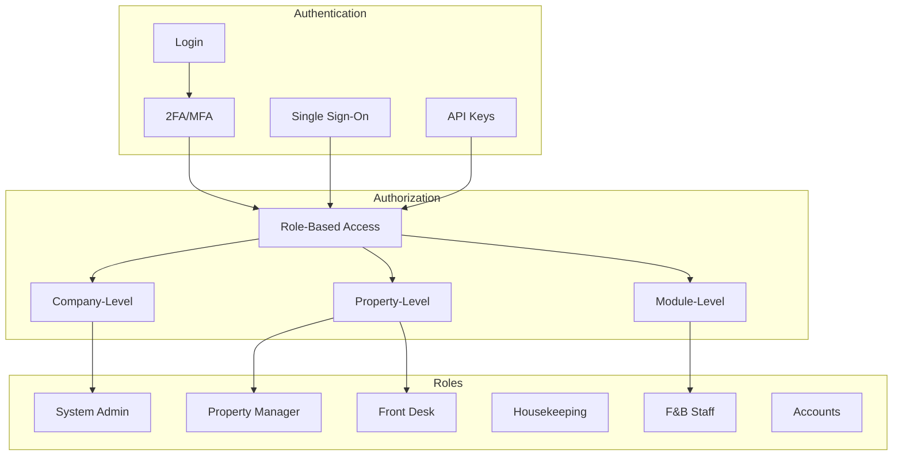

### Data Security Layers

1. **Application Level**
   - Input validation
   - SQL injection prevention
   - XSS protection
   - CSRF tokens

2. **Transport Level**
   - TLS 1.3 encryption
   - Certificate pinning
   - API rate limiting
   - DDoS protection

3. **Data Level**
   - Encryption at rest
   - Field-level encryption for PII
   - Audit logging
   - Data masking

4. **Compliance**
   - GDPR compliance
   - PCI DSS for payments
   - Data retention policies
   - Right to forget implementation

## 🚀 Deployment Architecture

### Production Deployment

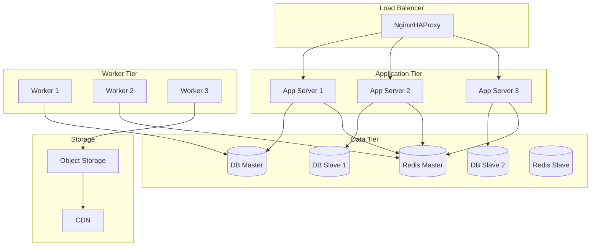

### Container Architecture

```yaml
# docker-compose.yml
version: '3.8'

services:
  tb-app:
    image: techbirdit/tb-suite:latest
    environment:
      - SITE_NAME=hotel.local
      - DB_HOST=mariadb
      - REDIS_CACHE=redis://redis:6379/0
    volumes:
      - sites:/home/frappe/frappe-bench/sites
      - apps:/home/frappe/frappe-bench/apps
    
  tb-worker:
    image: techbirdit/tb-suite:latest
    command: bench worker
    environment:
      - SITE_NAME=hotel.local
    
  tb-scheduler:
    image: techbirdit/tb-suite:latest
    command: bench schedule
    
  mariadb:
    image: mariadb:10.6
    environment:
      - MYSQL_ROOT_PASSWORD=admin
      - MYSQL_DATABASE=tb_suite
    
  redis:
    image: redis:7-alpine
    
  nginx:
    image: nginx:alpine
    ports:
      - "80:80"
      - "443:443"
```

## 📊 Performance Architecture

### Caching Strategy

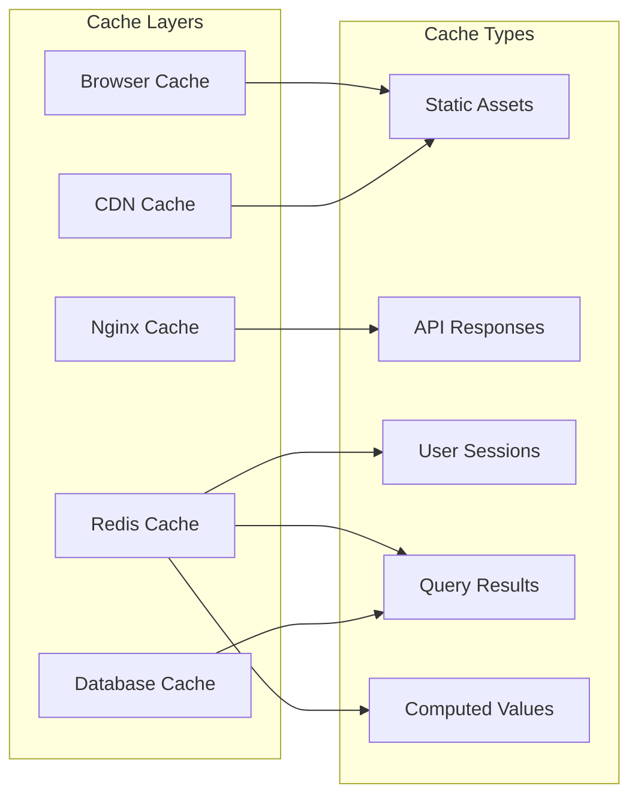

### Optimization Techniques

1. **Database Optimization**
   - Proper indexing
   - Query optimization
   - Connection pooling
   - Read replicas

2. **Application Optimization**
   - Lazy loading
   - Pagination
   - Batch processing
   - Async operations

3. **Frontend Optimization**
   - Code splitting
   - Tree shaking
   - Image optimization
   - Progressive web app

4. **Infrastructure Optimization**
   - Auto-scaling
   - Load balancing
   - CDN distribution
   - Edge computing

## 🔄 Scalability Patterns

### Horizontal Scaling

- Add more application servers
- Distribute load across servers
- Scale workers independently
- Use read replicas for reports

### Vertical Scaling

- Increase server resources
- Optimize database performance
- Upgrade Redis capacity
- Enhanced caching

### Microservices Evolution

Future architecture can evolve to:
- Separate PMS service
- Independent POS service
- Standalone travel service
- Dedicated integration service

---

*TB Suite Architecture - Built for scale, designed for flexibility*
