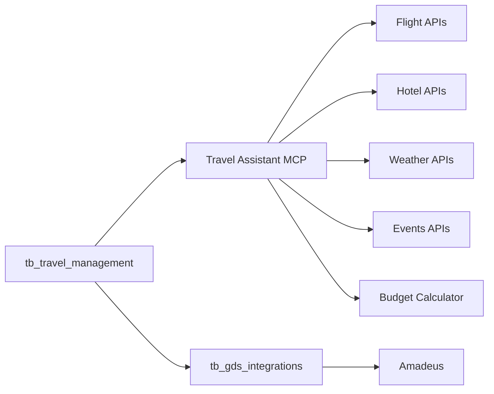
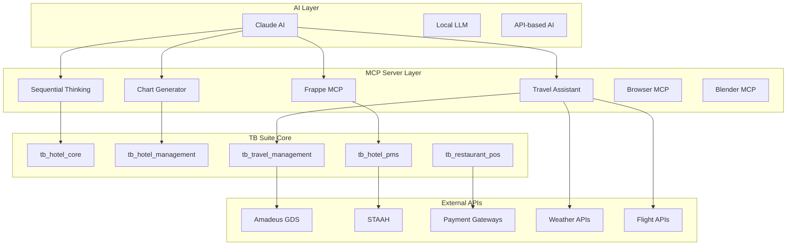
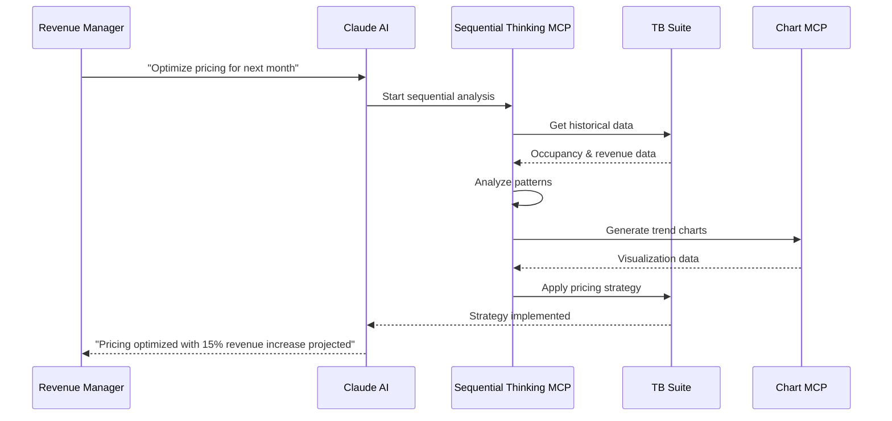
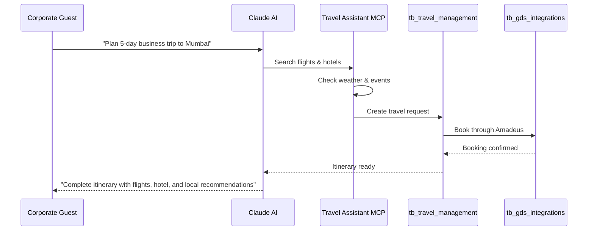
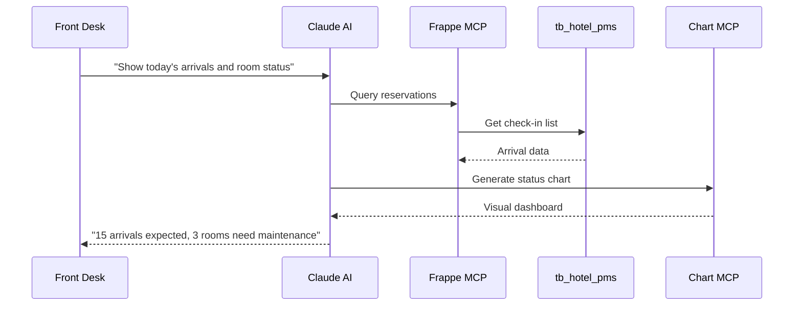
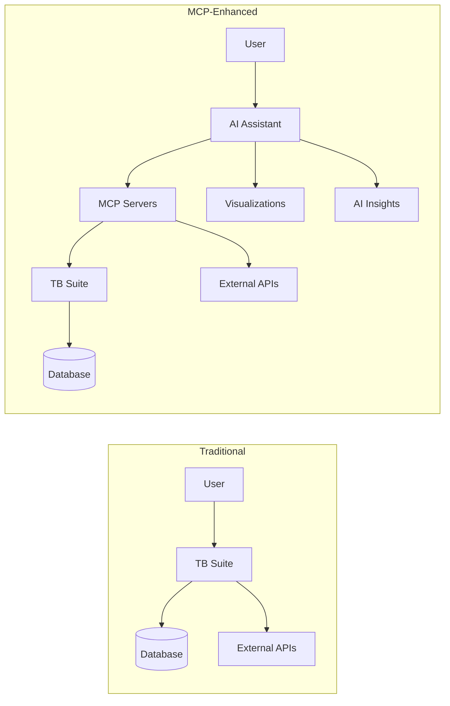

# TB Suite - MCP Server Integration Guide

## 🔌 Model Context Protocol (MCP) Integration

The TB Suite leverages MCP servers to enhance AI capabilities and provide intelligent automation across hospitality operations. MCP servers enable seamless communication between AI assistants and the TB Suite platform.

## 🎯 Integrated MCP Servers

### Core TB Suite MCP Servers

#### 1. Sequential Thinking Server
**Source:** [MCP Servers - Sequential Thinking](https://mcpservers.org/servers/arben-adm/mcp-sequential-thinking)  
**Purpose:** Structured problem-solving and decision-making workflows

**Use Cases in TB Suite:**
- **Revenue Management:** Progressive pricing analysis
- **Operational Planning:** Step-by-step workflow optimization  
- **Problem Resolution:** Systematic troubleshooting approach
- **Strategic Planning:** Multi-stage business planning

**Configuration:**
```json
{
  "mcpServers": {
    "sequential-thinking": {
      "url": "https://remote.mcpservers.org/sequentialthinking/mcp",
      "headers": {}
    }
  }
}
```

**Example Usage:**
```python
# Revenue optimization workflow
def optimize_pricing_strategy():
    # Stage 1: Problem Definition
    analyze_current_occupancy_trends()
    
    # Stage 2: Research
    gather_competitor_pricing_data()
    
    # Stage 3: Analysis
    calculate_demand_elasticity()
    
    # Stage 4: Synthesis
    develop_pricing_recommendations()
    
    # Stage 5: Conclusion
    implement_pricing_strategy()
```

#### 2. Travel Assistant MCP Suite
**Source:** [GitHub - Travel Assistant](https://github.com/skarlekar/mcp_travelassistant)  
**Purpose:** Comprehensive travel planning and booking assistance

**Components:**
- **Flight Search:** Real-time flight availability and pricing
- **Hotel Search:** Accommodation discovery and comparison
- **Weather Analysis:** Destination weather forecasting
- **Event Discovery:** Local events and activities
- **Budget Management:** Cost tracking and optimization
- **Itinerary Planning:** Day-by-day schedule generation

**Integration with tb_travel_management:**


**Configuration:**
```json
{
  "mcpServers": {
    "travel-assistant": {
      "command": "uvx",
      "args": [
        "--from",
        "git+https://github.com/skarlekar/mcp_travelassistant",
        "mcp-travelassistant"
      ],
      "env": {
        "SERPAPI_KEY": "your_serpapi_key",
        "WEATHER_API_KEY": "your_weather_key"
      }
    }
  }
}
```

#### 3. Chart Generation MCP
**Purpose:** Dynamic chart and visualization generation

**Use Cases:**
- **Occupancy Charts:** Visual room occupancy trends
- **Revenue Dashboards:** Financial performance visualization
- **F&B Analytics:** Restaurant performance charts
- **Travel Analytics:** Booking pattern visualization

**Configuration:**
```json
{
  "mcpServers": {
    "chart-generator": {
      "command": "npx",
      "args": ["-y", "@antv/mcp-server-chart"]
    }
  }
}
```

#### 4. Frappe MCP Server
**Purpose:** Direct integration with Frappe Framework

**Features:**
- Document CRUD operations
- Schema management
- Report generation
- Workflow automation

**Configuration:**
```json
{
  "mcpServers": {
    "frappe": {
      "command": "npx",
      "args": ["frappe-mcp-server"],
      "env": {
        "FRAPPE_URL": "http://localhost:8001",
        "FRAPPE_API_KEY": "your_api_key",
        "FRAPPE_API_SECRET": "your_api_secret"
      }
    }
  }
}
```

## 🏗️ Enhanced TB Suite Architecture with MCP



## 🚀 UV Package Manager Integration

### What is UV?
UV is a fast Python package manager and project manager by Astral (creators of Ruff). It's significantly faster than pip and provides better dependency resolution.

### Benefits for TB Suite:
- **Speed:** 10-100x faster than pip for package installation
- **Better Resolution:** Superior dependency conflict resolution
- **Project Management:** Built-in virtual environment management
- **Reproducible Builds:** Lock file generation for consistent environments

### Enabling UV in Frappe Bench

```bash
# Set environment variable to use UV
export BENCH_USE_UV=1

# Install packages using UV
uv pip install frappe-bench

# Create new bench with UV
BENCH_USE_UV=1 bench init tb-bench --frappe-branch version-15

# Install apps with UV
BENCH_USE_UV=1 bench get-app erpnext
```

### UV Configuration for TB Suite

Create `uv.toml` in the bench directory:
```toml
[tool.uv]
# Use UV for all Python operations
python = "3.10"
index-url = "https://pypi.org/simple/"

[tool.uv.sources]
# Local development packages
tb_hotel_core = { path = "apps/tb_hotel_core", editable = true }
tb_hotel_pms = { path = "apps/tb_hotel_pms", editable = true }
tb_restaurant_pos = { path = "apps/tb_restaurant_pos", editable = true }

[tool.uv.dev-dependencies]
# Development tools
pytest = ">=7.0"
black = ">=23.0"
ruff = ">=0.1.0"
mypy = ">=1.0"
```

## 🎯 MCP-Enhanced Workflows

### 1. Intelligent Revenue Management



### 2. Automated Travel Planning



### 3. Intelligent PMS Operations



## 🔧 Implementation Guide

### Step 1: Install MCP Servers

```bash
# Install UV package manager (if not already installed)
curl -LsSf https://astral.sh/uv/install.sh | sh

# Install travel assistant MCP
uvx --from git+https://github.com/skarlekar/mcp_travelassistant mcp-travelassistant

# Install sequential thinking MCP
uvx --from git+https://github.com/arben-adm/mcp-sequential-thinking mcp-sequential-thinking
```

### Step 2: Configure Claude Desktop

Update your Claude Desktop configuration at `/Users/ekanshjain/.cursor/mcp.json`:

```json
{
  "mcpServers": {
    "tb-sequential-thinking": {
      "command": "uvx",
      "args": [
        "--from",
        "git+https://github.com/arben-adm/mcp-sequential-thinking",
        "mcp-sequential-thinking"
      ]
    },
    "tb-travel-assistant": {
      "command": "uvx",
      "args": [
        "--from", 
        "git+https://github.com/skarlekar/mcp_travelassistant",
        "mcp-travelassistant"
      ],
      "env": {
        "SERPAPI_KEY": "your_serpapi_key",
        "WEATHER_API_KEY": "your_weather_api_key"
      }
    },
    "tb-frappe": {
      "command": "npx",
      "args": ["frappe-mcp-server"],
      "env": {
        "FRAPPE_URL": "http://localhost:8001",
        "FRAPPE_API_KEY": "your_api_key",
        "FRAPPE_API_SECRET": "your_api_secret"
      }
    },
    "tb-charts": {
      "command": "npx",
      "args": ["-y", "@antv/mcp-server-chart"]
    }
  }
}
```

### Step 3: Create TB Suite MCP Integration Module

Create a new module: `tb_mcp_bridge`

```python
# tb_mcp_bridge/mcp_bridge/__init__.py
"""
TB Suite MCP Bridge
Connects TB Suite with MCP servers for AI-enhanced operations
"""

__version__ = "1.0.0"

# MCP Server configurations
MCP_SERVERS = {
    "sequential_thinking": {
        "endpoint": "https://remote.mcpservers.org/sequentialthinking/mcp",
        "capabilities": ["problem_solving", "decision_making", "planning"]
    },
    "travel_assistant": {
        "local_command": "mcp-travelassistant",
        "capabilities": ["flight_search", "hotel_search", "itinerary_planning"]
    },
    "chart_generator": {
        "local_command": "mcp-server-chart",
        "capabilities": ["data_visualization", "dashboard_creation"]
    }
}
```

### Step 4: Update TB Suite Environment

Create enhanced environment setup script:

```bash
# setup_tb_suite_enhanced.sh
#!/bin/bash

echo "🚀 Setting up TB Suite with MCP Integration..."

# Enable UV for bench
export BENCH_USE_UV=1

# Install UV if not present
if ! command -v uv &> /dev/null; then
    echo "Installing UV package manager..."
    curl -LsSf https://astral.sh/uv/install.sh | sh
fi

# Initialize bench with UV
echo "Initializing TB Suite bench with UV..."
uv venv
source .venv/bin/activate
BENCH_USE_UV=1 bench init tb-bench --frappe-branch version-15

cd tb-bench

# Install core apps with UV
echo "Installing core applications..."
BENCH_USE_UV=1 bench get-app erpnext --branch version-15

# Install TB Suite modules
echo "Installing TB Suite modules..."
BENCH_USE_UV=1 bench get-app https://github.com/ekanshjain/tb_hotel_core.git
BENCH_USE_UV=1 bench get-app https://github.com/ekanshjain/tb_hotel_management.git
BENCH_USE_UV=1 bench get-app https://github.com/ekanshjain/tb_hotel_pms.git
BENCH_USE_UV=1 bench get-app https://github.com/ekanshjain/tb_restaurant_pos.git
BENCH_USE_UV=1 bench get-app https://github.com/ekanshjain/tb_restaurant_management.git
BENCH_USE_UV=1 bench get-app https://github.com/ekanshjain/tb_travel_management.git
BENCH_USE_UV=1 bench get-app https://github.com/ekanshjain/tb_gds_integrations.git

# Install MCP Bridge
BENCH_USE_UV=1 bench get-app https://github.com/ekanshjain/tb_mcp_bridge.git

# Install MCP servers
echo "Installing MCP servers..."
uvx --from git+https://github.com/arben-adm/mcp-sequential-thinking mcp-sequential-thinking
uvx --from git+https://github.com/skarlekar/mcp_travelassistant mcp-travelassistant

# Create site
echo "Creating TB Suite site..."
bench new-site tb.local
bench --site tb.local install-app erpnext
bench --site tb.local install-app tb_hotel_core
bench --site tb.local install-app tb_hotel_management
bench --site tb.local install-app tb_hotel_pms
bench --site tb.local install-app tb_mcp_bridge

echo "✅ TB Suite setup complete with MCP integration!"
echo "🌐 Access at: http://localhost:8001"
```

## 🎯 AI-Enhanced Features

### 1. Intelligent Front Desk Assistant

```python
# AI-powered front desk operations
class IntelligentFrontDesk:
    def __init__(self):
        self.mcp_sequential = MCPSequentialThinking()
        self.mcp_charts = MCPChartGenerator()
    
    def handle_guest_request(self, request):
        """Process complex guest requests using sequential thinking"""
        
        # Use sequential thinking for complex requests
        thinking_process = self.mcp_sequential.process_thought(
            thought=f"Guest request: {request}",
            stage="Problem Definition",
            thought_number=1,
            total_thoughts=5
        )
        
        # Analyze options systematically
        return self.generate_response(thinking_process)
    
    def generate_occupancy_dashboard(self, date_range):
        """Create real-time occupancy visualizations"""
        
        data = self.get_occupancy_data(date_range)
        
        chart = self.mcp_charts.generate_chart(
            type="line",
            data=data,
            title="Occupancy Trends"
        )
        
        return chart
```

### 2. Smart Travel Booking Integration

```python
# Enhanced travel booking with MCP
class SmartTravelBooking:
    def __init__(self):
        self.travel_assistant = MCPTravelAssistant()
        self.sequential_thinking = MCPSequentialThinking()
    
    def plan_corporate_trip(self, requirements):
        """AI-powered trip planning"""
        
        # Step 1: Analyze requirements
        analysis = self.sequential_thinking.process_thought(
            thought=f"Corporate trip requirements: {requirements}",
            stage="Analysis",
            thought_number=1
        )
        
        # Step 2: Search options
        flight_options = self.travel_assistant.search_flights(
            origin=requirements.origin,
            destination=requirements.destination,
            dates=requirements.dates
        )
        
        hotel_options = self.travel_assistant.search_hotels(
            location=requirements.destination,
            dates=requirements.dates,
            budget=requirements.budget
        )
        
        # Step 3: Optimize selection
        optimal_plan = self.sequential_thinking.process_thought(
            thought=f"Optimize from {len(flight_options)} flights and {len(hotel_options)} hotels",
            stage="Synthesis",
            thought_number=2
        )
        
        return optimal_plan
```

### 3. Revenue Optimization Engine

```python
# AI-driven revenue management
class RevenueOptimizer:
    def __init__(self):
        self.sequential = MCPSequentialThinking()
        self.charts = MCPChartGenerator()
    
    def optimize_pricing(self, property_id, date_range):
        """Multi-stage pricing optimization"""
        
        # Stage 1: Problem Definition
        problem = self.sequential.process_thought(
            thought=f"Optimize pricing for property {property_id}",
            stage="Problem Definition",
            thought_number=1,
            total_thoughts=5
        )
        
        # Stage 2: Research
        market_data = self.get_market_data(property_id, date_range)
        research = self.sequential.process_thought(
            thought=f"Market analysis: {market_data}",
            stage="Research", 
            thought_number=2
        )
        
        # Stage 3: Analysis
        patterns = self.analyze_patterns(market_data)
        analysis = self.sequential.process_thought(
            thought=f"Identified patterns: {patterns}",
            stage="Analysis",
            thought_number=3
        )
        
        # Stage 4: Synthesis
        strategy = self.develop_strategy(patterns)
        synthesis = self.sequential.process_thought(
            thought=f"Pricing strategy: {strategy}",
            stage="Synthesis",
            thought_number=4
        )
        
        # Stage 5: Conclusion
        implementation = self.sequential.process_thought(
            thought=f"Implementation plan: {strategy}",
            stage="Conclusion",
            thought_number=5,
            next_thought_needed=False
        )
        
        # Generate visualization
        chart = self.charts.generate_chart(
            type="line",
            data=strategy.pricing_data,
            title="Optimized Pricing Strategy"
        )
        
        return {
            "strategy": strategy,
            "visualization": chart,
            "thinking_process": self.sequential.generate_summary()
        }
```

## 📊 Enhanced Data Flow with MCP

### Traditional Flow vs MCP-Enhanced Flow



## 🔧 Implementation Roadmap

### Phase 1: MCP Infrastructure (Week 1)
- [ ] Install and configure MCP servers
- [ ] Create tb_mcp_bridge module
- [ ] Set up UV package manager
- [ ] Test basic MCP connectivity

### Phase 2: Sequential Thinking Integration (Week 2)
- [ ] Implement revenue optimization workflows
- [ ] Add problem-solving frameworks
- [ ] Create decision-making templates
- [ ] Test complex operational scenarios

### Phase 3: Travel Assistant Integration (Week 3)
- [ ] Connect travel MCP to tb_travel_management
- [ ] Implement flight search integration
- [ ] Add hotel booking capabilities
- [ ] Create itinerary planning workflows

### Phase 4: Visualization & Analytics (Week 4)
- [ ] Integrate chart generation MCP
- [ ] Create dynamic dashboards
- [ ] Implement real-time reporting
- [ ] Add predictive analytics

## 🎯 Business Impact

### Enhanced Capabilities

| Traditional TB Suite | MCP-Enhanced TB Suite |
|---------------------|----------------------|
| Manual pricing decisions | AI-optimized pricing with sequential analysis |
| Basic travel booking | Intelligent trip planning with weather/events |
| Static reports | Dynamic visualizations with insights |
| Rule-based workflows | AI-driven decision making |
| Reactive operations | Predictive operations |

### ROI Projections

- **Revenue Optimization:** 10-15% increase through AI pricing
- **Operational Efficiency:** 30% reduction in manual tasks
- **Guest Satisfaction:** 25% improvement through personalized service
- **Staff Productivity:** 40% increase in complex task handling

## 🔐 Security & Privacy

### MCP Security Framework

```yaml
Security Measures:
  Authentication:
    - API key validation
    - Token-based access
    - Role-based permissions
  
  Data Protection:
    - Encrypted communication
    - Local data processing
    - No external data storage
  
  Access Control:
    - User-level permissions
    - Module-level restrictions
    - API rate limiting
```

### Privacy Considerations

- Guest data never leaves TB Suite environment
- MCP servers process only aggregated/anonymized data
- All AI processing happens locally where possible
- External API calls are logged and monitored

## 📈 Monitoring & Analytics

### MCP Performance Metrics

```python
# MCP performance tracking
class MCPMonitor:
    def track_usage(self):
        metrics = {
            "sequential_thinking_calls": 0,
            "travel_assistant_queries": 0,
            "chart_generations": 0,
            "average_response_time": 0,
            "success_rate": 0
        }
        return metrics
    
    def generate_insights(self):
        """AI usage insights for business optimization"""
        pass
```

---

## 🚀 Next Steps

1. **Immediate Implementation:**
   - Set up MCP servers in development environment
   - Configure UV package manager
   - Test basic MCP connectivity

2. **Integration Development:**
   - Create tb_mcp_bridge module
   - Implement AI-enhanced workflows
   - Add visualization capabilities

3. **Production Deployment:**
   - Security hardening
   - Performance optimization
   - User training

The integration of these MCP servers transforms TB Suite from a traditional PMS into an AI-powered, intelligent hospitality platform that can think, analyze, and optimize operations automatically.

---

*TB Suite + MCP Integration - Where AI meets hospitality excellence*  
*References:*
- [Sequential Thinking MCP Server](https://mcpservers.org/servers/arben-adm/mcp-sequential-thinking)
- [Travel Assistant MCP Suite](https://github.com/skarlekar/mcp_travelassistant)
