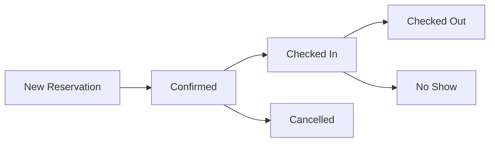
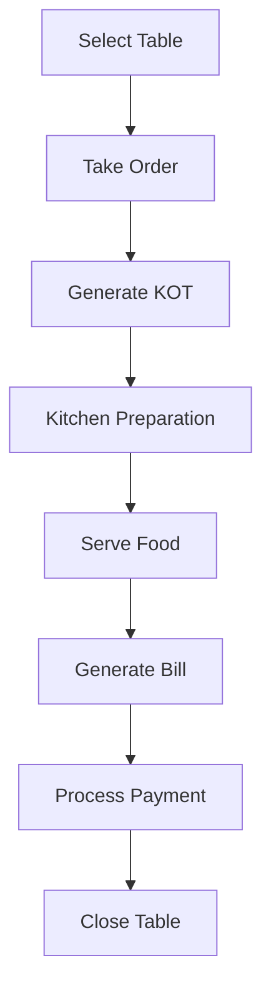
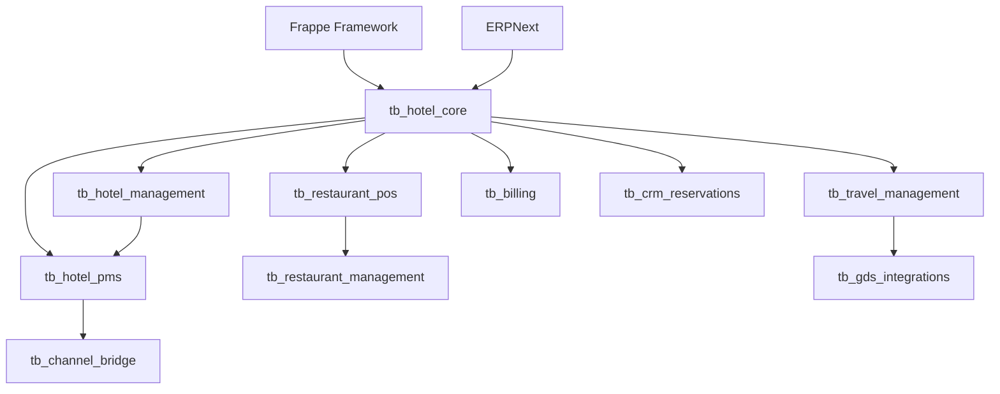

# TB Suite - Modules Overview

## 📦 Module Architecture

The TB Suite is designed with a modular architecture where each module serves a specific business function. Modules can be enabled/disabled based on business requirements.

## 🏨 Core Modules

### tb_hotel_core
**Purpose:** Foundation module containing core entities and shared functionality  
**Required:** Yes (mandatory for all installations)  
**Dependencies:** frappe, erpnext  

**Key Features:**
- Property and room management
- Room types and rate plans
- Banquet halls and event spaces
- Licenses and compliance tracking
- Multi-company setup
- Base configurations

**When to Enable:**
- Always enabled (foundation module)
- Required for any TB Suite functionality

**DocTypes:**
- Company Settings
- Property
- Building
- Floor
- Room
- Room Type
- Rate Plan
- Seasonal Rate
- Banquet Hall
- License
- Contract

---

### tb_hotel_management
**Purpose:** Multi-property and head office management  
**Required:** Yes (for multi-property setups)  
**Dependencies:** tb_hotel_core  

**Key Features:**
- Multi-property dashboard
- Centralized inventory management
- Cross-property reporting
- Revenue management
- Head office controls
- Shared services management

**When to Enable:**
- Managing multiple properties
- Need centralized control
- Head office operations
- Chain hotel management

**DocTypes:**
- Property Group
- Central Reservation
- Revenue Center
- Shared Service
- Inter-Property Transfer
- Consolidated Report

---

## 🏩 PMS Modules

### tb_hotel_pms
**Purpose:** Property Management System for front desk operations  
**Required:** For hotel operations  
**Dependencies:** tb_hotel_core, tb_hotel_management  

**Key Features:**
- Reservation management
- Check-in/check-out processing
- Room assignment and blocking
- Folio management
- Housekeeping coordination
- Night audit procedures
- Guest history tracking
- Tape chart visualization

**When to Enable:**
- Running hotel operations
- Need reservation system
- Managing room inventory
- Front desk operations

**DocTypes:**
- Reservation
- Guest Registration
- Room Assignment
- Folio
- Folio Charge
- Housekeeping Task
- Room Status
- Night Audit
- Guest History

**Workflows:**


---

## 🍽️ Restaurant Modules

### tb_restaurant_pos
**Purpose:** Point of Sale for restaurant operations  
**Required:** For F&B operations  
**Dependencies:** tb_hotel_core  

**Key Features:**
- Table management
- Order taking and KOT generation
- Bill generation and splitting
- Payment processing
- Room service management
- Cashier reconciliation
- Void and discount management
- Multi-outlet support

**When to Enable:**
- Restaurant operations
- Room service requirements
- Bar operations
- Café or coffee shop

**DocTypes:**
- POS Profile
- Restaurant Table
- KOT (Kitchen Order Ticket)
- POS Order
- POS Bill
- Payment Method
- Cashier Shift
- Menu Item

**POS Flow:**


---

### tb_restaurant_management
**Purpose:** Back-office restaurant management  
**Required:** For complete F&B management  
**Dependencies:** tb_restaurant_pos  

**Key Features:**
- Menu engineering
- Recipe management
- Ingredient tracking
- Cost calculation
- Vendor management
- Purchase orders
- Stock management
- F&B analytics
- Wastage tracking

**When to Enable:**
- Need inventory control
- Recipe standardization
- Cost management
- Multiple outlets
- Central kitchen operations

**DocTypes:**
- Recipe
- Ingredient
- Menu Category
- Menu Engineering
- Purchase Order
- Stock Entry
- Vendor
- Cost Center
- Wastage Log

---

## ✈️ Travel Modules

### tb_travel_management
**Purpose:** Corporate and leisure travel management  
**Required:** For travel services  
**Dependencies:** tb_hotel_core  

**Key Features:**
- Flight booking management
- Hotel reservation (external)
- Travel package creation
- Itinerary management
- Corporate travel policies
- Credit management
- Expense tracking
- Travel reports

**When to Enable:**
- Travel agency operations
- Corporate travel desk
- Package tour operations
- B2B travel services

**DocTypes:**
- Travel Request
- Itinerary
- Travel Package
- Flight Booking
- Hotel Booking (External)
- Travel Policy
- Credit Profile
- Travel Invoice

---

### tb_gds_integrations
**Purpose:** Global Distribution System connectivity  
**Required:** For GDS access  
**Dependencies:** tb_travel_management  

**Key Features:**
- Amadeus integration
- Sabre connectivity (planned)
- Galileo support (planned)
- Real-time availability
- PNR management
- Ticket issuance
- Queue management
- Fare calculation

**When to Enable:**
- Need GDS access
- Flight booking requirements
- Global hotel inventory
- Professional travel services

**Provider Interfaces:**
```python
class AmadeusProvider:
    - search_flights()
    - create_pnr()
    - issue_ticket()
    - cancel_booking()
    - retrieve_pnr()
```

---

## 🔌 Integration Modules

### tb_channel_bridge
**Purpose:** Channel manager and OTA connectivity  
**Required:** For online distribution  
**Dependencies:** tb_hotel_pms  
**Status:** Scaffold (basic structure only)  

**Planned Features:**
- STAAH integration
- Direct OTA connections
- Rate and inventory sync
- Booking downloads
- Channel performance analytics

**When to Enable:**
- Selling through OTAs
- Need channel management
- Multi-channel distribution

---

### tb_billing
**Purpose:** Advanced billing and invoicing  
**Required:** For complex billing needs  
**Dependencies:** tb_hotel_core  
**Status:** Scaffold (basic structure only)  

**Planned Features:**
- GST-compliant invoicing
- Multi-currency billing
- Credit note management
- Recurring invoices
- Payment reminders
- Aging analysis

**When to Enable:**
- Complex billing requirements
- Multi-currency operations
- Credit management needs

---

### tb_crm_reservations
**Purpose:** Customer relationship and loyalty management  
**Required:** For CRM features  
**Dependencies:** tb_hotel_core  
**Status:** Scaffold (basic structure only)  

**Planned Features:**
- Guest profiles
- Preference tracking
- Loyalty programs
- Marketing campaigns
- Guest feedback
- Corporate accounts

**When to Enable:**
- Guest loyalty programs
- Marketing automation
- Corporate relationship management

---

## 🎯 Module Selection Guide

### Small Boutique Hotel (10-50 rooms)
```
Essential:
✅ tb_hotel_core
✅ tb_hotel_pms
⚪ tb_restaurant_pos (if has restaurant)

Optional:
⚪ tb_channel_bridge (for OTA sales)
⚪ tb_billing (for advanced billing)
```

### Business Hotel (50-200 rooms)
```
Essential:
✅ tb_hotel_core
✅ tb_hotel_management
✅ tb_hotel_pms
✅ tb_restaurant_pos
✅ tb_restaurant_management

Recommended:
✅ tb_channel_bridge
✅ tb_billing
⚪ tb_crm_reservations

Optional:
⚪ tb_travel_management (for corporate clients)
```

### Hotel Chain (Multiple Properties)
```
Essential:
✅ tb_hotel_core
✅ tb_hotel_management
✅ tb_hotel_pms
✅ tb_restaurant_pos
✅ tb_restaurant_management
✅ tb_channel_bridge

Recommended:
✅ tb_billing
✅ tb_crm_reservations
✅ tb_travel_management

Optional:
⚪ tb_gds_integrations
```

### Restaurant Chain
```
Essential:
✅ tb_hotel_core (modified for restaurant)
✅ tb_restaurant_pos
✅ tb_restaurant_management

Recommended:
✅ tb_billing
✅ tb_crm_reservations
```

### Travel Agency
```
Essential:
✅ tb_hotel_core
✅ tb_travel_management
✅ tb_gds_integrations

Recommended:
✅ tb_billing
✅ tb_crm_reservations
```

## 📊 Module Comparison Matrix

| Feature | Core | Mgmt | PMS | POS | Rest Mgmt | Travel | GDS | Channel | Billing | CRM |
|---------|------|------|-----|-----|-----------|--------|-----|---------|---------|-----|
| Multi-property | ✅ | ✅ | ✅ | ✅ | ✅ | ✅ | - | ✅ | ✅ | ✅ |
| Reservations | - | - | ✅ | - | - | ✅ | - | ✅ | - | ✅ |
| Inventory | ✅ | ✅ | ✅ | ✅ | ✅ | - | - | ✅ | - | - |
| Billing | Basic | - | ✅ | ✅ | - | ✅ | - | - | ✅ | - |
| Reports | Basic | ✅ | ✅ | ✅ | ✅ | ✅ | ✅ | ✅ | ✅ | ✅ |
| Mobile Ready | ✅ | ✅ | ✅ | ✅ | - | ✅ | - | - | ✅ | ✅ |
| API Access | ✅ | ✅ | ✅ | ✅ | ✅ | ✅ | ✅ | ✅ | ✅ | ✅ |

## 🔄 Module Dependencies Graph



## 💰 Pricing Model

| Module | Monthly (per property/outlet) | Transaction Fee |
|--------|-------------------------------|-----------------|
| tb_hotel_core | Included | - |
| tb_hotel_management | ₹2,000 | - |
| tb_hotel_pms | ₹5,000 | - |
| tb_restaurant_pos | ₹3,000 | - |
| tb_restaurant_management | ₹2,000 | - |
| tb_travel_management | ₹8,000 | ₹10 per booking |
| tb_gds_integrations | ₹10,000 | ₹25 per ticket |
| tb_channel_bridge | ₹4,000 | - |
| tb_billing | ₹2,000 | - |
| tb_crm_reservations | ₹3,000 | - |

**Volume Discounts:**
- 3-5 properties: 10% discount
- 6-10 properties: 20% discount
- 11+ properties: Custom pricing

**Annual Payment:** 2 months free

---

*TB Suite Modules - Choose what you need, pay for what you use*
