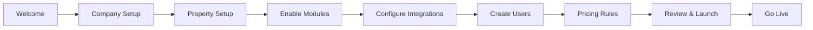

# TB Suite - Onboarding Wizard Specification

## 🎯 Overview

The TB Suite Onboarding Wizard provides a guided, multi-step setup process to configure the platform for any hospitality business. It supports multi-company, multi-property setups with modular feature activation.

## 🔄 Onboarding Flow



## 📋 Step-by-Step Configuration

### Step 1: Welcome Screen

```yaml
Screen: Welcome to TB Suite
Content:
  - Logo: TechBird TB Suite
  - Title: "Let's set up your hospitality business"
  - Options:
    - [ ] Single Property Hotel
    - [ ] Multi-Property Chain
    - [ ] Restaurant Only
    - [ ] Hotel + Restaurant
    - [ ] Travel Agency
    - [ ] Complete Suite
  - Industry Type:
    - [ ] Business Hotel
    - [ ] Resort
    - [ ] Boutique Hotel
    - [ ] Service Apartments
    - [ ] Restaurant Chain
    - [ ] Travel Management Company
Actions:
  - Continue
  - Import Existing Data
```

### Step 2: Company Setup

```yaml
Screen: Company Information
Fields:
  Basic Information:
    - Company Name*: [text]
    - Brand Name: [text]
    - Company Type: [Proprietorship|Partnership|Private Ltd|Public Ltd]
    - Registration Number: [text]
    - Tax ID/GST Number*: [text]
    - PAN Number: [text]
  
  Contact Details:
    - Address Line 1*: [text]
    - Address Line 2: [text]
    - City*: [text]
    - State/Province*: [dropdown]
    - Country*: [dropdown]
    - Postal Code*: [text]
    - Phone*: [tel]
    - Email*: [email]
    - Website: [url]
  
  Financial Settings:
    - Financial Year Start*: [date]
    - Default Currency*: [dropdown]
    - Time Zone*: [dropdown]
    - Date Format: [DD/MM/YYYY|MM/DD/YYYY|YYYY-MM-DD]
    
  Multi-Company Setup:
    - Is this a holding company?: [Yes/No]
    - Add subsidiary companies?: [Yes/No]
    
Actions:
  - Save & Continue
  - Add Another Company
  - Skip
```

### Step 3: Property Setup

```yaml
Screen: Property Configuration
Fields:
  Property Details:
    - Property Name*: [text]
    - Property Code*: [text, auto-generate]
    - Property Type*: [Hotel|Resort|Motel|Service Apartment|Villa]
    - Star Rating: [1⭐|2⭐|3⭐|4⭐|5⭐|Boutique|Heritage]
    - Company*: [dropdown - from Step 2]
    
  Location:
    - Address*: [text]
    - City*: [text]
    - GPS Coordinates: [lat, lng]
    - Landmark: [text]
    
  Capacity:
    - Total Buildings: [number]
    - Total Floors: [number]
    - Total Rooms*: [number]
    - Total Beds: [number]
    
  Room Types:
    - Quick Setup: [Use Templates]
      - Standard Templates:
        - [ ] Standard Room
        - [ ] Deluxe Room
        - [ ] Suite
        - [ ] Presidential Suite
    - Custom Setup: [+ Add Room Type]
      - Room Type Name*: [text]
      - Base Occupancy*: [number]
      - Max Occupancy*: [number]
      - Base Rate*: [currency]
      
  Amenities:
    - [ ] Swimming Pool
    - [ ] Gym
    - [ ] Spa
    - [ ] Restaurant
    - [ ] Bar
    - [ ] Conference Hall
    - [ ] Banquet Hall
    - [ ] Business Center
    - [ ] Parking
    - [ ] Airport Shuttle
    - [ ] WiFi
    - [ ] Laundry Service
    
  Operating Hours:
    - Check-in Time*: [time, default: 14:00]
    - Check-out Time*: [time, default: 12:00]
    - Early Check-in Allowed: [Yes/No]
    - Late Check-out Allowed: [Yes/No]
    
Actions:
  - Save Property
  - Add Another Property
  - Import Room Data (CSV/Excel)
  - Continue
```

### Step 4: Enable Modules

```yaml
Screen: Select TB Suite Modules
Core Modules (Required):
  ✅ tb_hotel_core - Foundation module (auto-enabled)
  ✅ tb_hotel_management - Multi-property control (auto-enabled)

Operational Modules:
  [ ] tb_hotel_pms - Property Management System
    Features:
      - Front desk operations
      - Reservations & bookings
      - Check-in/Check-out
      - Housekeeping
      - Night audit
    Monthly: ₹5,000 per property
    
  [ ] tb_restaurant_pos - Restaurant Point of Sale
    Features:
      - Table management
      - KOT generation
      - Billing & payments
      - Room service
      - Inventory tracking
    Monthly: ₹3,000 per outlet
    
  [ ] tb_restaurant_management - F&B Management
    Features:
      - Menu engineering
      - Recipe management
      - Cost control
      - Vendor management
      - Analytics
    Monthly: ₹2,000 per outlet
    
  [ ] tb_travel_management - Travel Booking System
    Features:
      - Flight bookings
      - Hotel bookings
      - Package creation
      - Corporate travel
      - Expense management
    Monthly: ₹8,000 per company
    
Integration Modules:
  [ ] tb_gds_integrations - Global Distribution System
    Providers:
      - [ ] Amadeus
      - [ ] Sabre
      - [ ] Galileo
    Monthly: ₹10,000 + transaction fees
    
  [ ] tb_channel_bridge - Channel Manager
    Channels:
      - [ ] STAAH integration
      - [ ] Direct OTA connections
    Monthly: ₹4,000 per property
    
  [ ] tb_billing - Advanced Billing
    Features:
      - GST compliance
      - Multi-currency
      - Credit management
    Monthly: ₹2,000
    
  [ ] tb_crm_reservations - CRM & Loyalty
    Features:
      - Guest profiles
      - Loyalty programs
      - Marketing automation
    Monthly: ₹3,000

Estimated Monthly Cost: ₹ [calculated total]

Actions:
  - Review Selection
  - Continue
  - Request Custom Pricing
```

### Step 5: Configure Integrations

```yaml
Screen: External Integrations
Payment Gateways:
  [ ] Razorpay
    - API Key: [text]
    - Secret Key: [password]
    - Webhook URL: [auto-generated]
    
  [ ] Stripe
    - Publishable Key: [text]
    - Secret Key: [password]
    
  [ ] PayU
    - Merchant Key: [text]
    - Salt: [text]
    
  [ ] Bank Transfer
    - Bank Name: [text]
    - Account Number: [text]
    - IFSC Code: [text]
    
Communication:
  [ ] SMS Gateway
    - [ ] Twilio
      - Account SID: [text]
      - Auth Token: [password]
      - From Number: [tel]
    - [ ] Exotel
      - SID: [text]
      - Token: [password]
      - Caller ID: [tel]
    
  [ ] WhatsApp Business
    - API Endpoint: [url]
    - Access Token: [password]
    - Phone Number ID: [text]
    
  [ ] Email Service
    - SMTP Server: [text]
    - Port: [number]
    - Username: [email]
    - Password: [password]
    - Use TLS: [Yes/No]
    
Channel Manager (if tb_channel_bridge enabled):
  [ ] STAAH
    - Property ID: [text]
    - Username: [text]
    - Password: [password]
    - API Endpoint: [url]
    
GDS (if tb_gds_integrations enabled):
  [ ] Amadeus
    - Client ID: [text]
    - Client Secret: [password]
    - Office ID: [text]
    - Environment: [Test/Production]
    
Banking:
  [ ] Auto Bank Reconciliation
    - Bank: [dropdown]
    - API Credentials: [text]
    
Actions:
  - Test Connection
  - Save Configuration
  - Skip for Now
  - Continue
```

### Step 6: Create Users

```yaml
Screen: User Setup
Admin User (already created):
  - Username: Administrator
  - Email: [from company setup]
  
Add Department Heads:
  [ ] Front Office Manager
    - Name*: [text]
    - Email*: [email]
    - Mobile: [tel]
    - Properties: [multi-select]
    - Modules: [auto-assigned: PMS]
    
  [ ] Housekeeping Supervisor
    - Name*: [text]
    - Email*: [email]
    - Properties: [multi-select]
    
  [ ] F&B Manager
    - Name*: [text]
    - Email*: [email]
    - Outlets: [multi-select]
    - Modules: [auto-assigned: POS, Restaurant]
    
  [ ] Accounts Manager
    - Name*: [text]
    - Email*: [email]
    - Companies: [multi-select]
    
  [ ] Reservation Manager
    - Name*: [text]
    - Email*: [email]
    - Properties: [multi-select]
    
Quick Add Staff:
  - Import from CSV: [file upload]
  - Bulk Create: [number] Front Desk Users
  - Bulk Create: [number] Housekeeping Users
  - Bulk Create: [number] Service Staff
  
Actions:
  - Send Invitations
  - Create Users
  - Skip
  - Continue
```

### Step 7: Pricing Rules

```yaml
Screen: Pricing Configuration
Rate Plans:
  Default Plans (auto-created):
    ✅ Rack Rate (Standard published rate)
    ✅ Corporate Rate (B2B rate)
    ✅ Online Rate (OTA rate)
    
  Custom Rate Plans:
    [ ] Add Custom Plan
      - Plan Name*: [text]
      - Plan Code*: [text]
      - Discount Type: [Percentage|Fixed]
      - Discount Value: [number]
      - Valid From: [date]
      - Valid To: [date]
      - Applicable Days: [Mon|Tue|Wed|Thu|Fri|Sat|Sun]
      - Minimum Nights: [number]
      - Maximum Nights: [number]
      
Seasonal Rates:
  [ ] Enable Dynamic Pricing
    Peak Season:
      - Date Ranges: [+ Add Range]
      - Multiplier: [1.5x default]
    
    Off Season:
      - Date Ranges: [+ Add Range]
      - Multiplier: [0.8x default]
    
    Special Events:
      - Event Name: [text]
      - Dates: [date range]
      - Multiplier: [2x default]
      
Taxes & Fees:
  [ ] GST Configuration
    - CGST: [9%]
    - SGST: [9%]
    - IGST: [18%]
    
  [ ] Additional Fees
    - Service Charge: [percentage]
    - Luxury Tax: [percentage]
    - Municipality Tax: [fixed amount]
    
Credit Policies:
  [ ] Corporate Credit
    - Default Credit Days: [30]
    - Credit Limit: [amount]
    - Approval Required Above: [amount]
    
  [ ] Travel Agent Commission
    - Default Commission: [10%]
    - Payment Terms: [After Check-out|Monthly]
    
Actions:
  - Save Pricing Rules
  - Continue
  - Advanced Configuration
```

### Step 8: Review & Launch

```yaml
Screen: Configuration Summary
Summary:
  Company:
    - Name: [Display Name]
    - Properties: [Count]
    - Users: [Count]
    
  Modules Enabled:
    - Core: ✅ tb_hotel_core, tb_hotel_management
    - PMS: [✅/❌] tb_hotel_pms
    - Restaurant: [✅/❌] tb_restaurant_pos, tb_restaurant_management
    - Travel: [✅/❌] tb_travel_management
    - Integrations: [List enabled]
    
  Integrations:
    - Payment: [List configured]
    - Communication: [List configured]
    - Channel Manager: [Status]
    - GDS: [Status]
    
  Monthly Subscription:
    - Base: ₹ [amount]
    - Modules: ₹ [amount]
    - Total: ₹ [total]
    
  Data Import:
    [ ] Import existing data
      - Guest Database: [CSV upload]
      - Reservation History: [CSV upload]
      - Rate Plans: [Excel upload]
    
  Training & Support:
    [ ] Schedule online training session
    [ ] Request on-site training
    [ ] Access video tutorials
    [ ] Download user manuals
    
Checklist:
  ✅ Company configured
  ✅ At least one property added
  ✅ Essential modules selected
  ✅ Admin user created
  ⚠️ Payment gateway pending
  ⚠️ SMS gateway pending
  
Actions:
  - Go Live
  - Save as Draft
  - Back to Edit
  - Export Configuration
```

### Step 9: Go Live

```yaml
Screen: Welcome to TB Suite!
Status: ✅ Your system is ready

Quick Actions:
  - [ ] Create first reservation
  - [ ] Add room inventory
  - [ ] Configure POS items
  - [ ] Import guest database
  - [ ] Set up housekeeping schedule
  
Resources:
  - 📚 User Guide
  - 🎥 Video Tutorials
  - 💬 Chat Support
  - 📞 Phone Support
  - 🎓 Training Schedule
  
Dashboard Access:
  - Property Dashboard → [Open]
  - Reservation Calendar → [Open]
  - POS Terminal → [Open]
  - Reports Center → [Open]
  
Next Steps:
  1. Complete staff training
  2. Test reservation flow
  3. Configure printers
  4. Set up night audit
  5. Enable auto-backup
  
Actions:
  - Go to Dashboard
  - Continue Setup
  - Schedule Training
```

## 🔧 Technical Implementation

### Backend API Endpoints

```python
# Onboarding API
POST /api/method/tb_hotel_core.onboarding.save_company
POST /api/method/tb_hotel_core.onboarding.save_property
POST /api/method/tb_hotel_core.onboarding.enable_modules
POST /api/method/tb_hotel_core.onboarding.configure_integrations
POST /api/method/tb_hotel_core.onboarding.create_users
POST /api/method/tb_hotel_core.onboarding.setup_pricing
POST /api/method/tb_hotel_core.onboarding.complete_setup

# Validation Endpoints
GET /api/method/tb_hotel_core.onboarding.validate_gst
GET /api/method/tb_hotel_core.onboarding.test_integration
GET /api/method/tb_hotel_core.onboarding.check_availability
```

### Frontend Components

```vue
<!-- OnboardingWizard.vue -->
<template>
  <div class="onboarding-wizard">
    <StepIndicator :current="currentStep" :steps="steps" />
    
    <transition name="slide">
      <component 
        :is="currentStepComponent"
        @next="nextStep"
        @prev="prevStep"
        @save="saveProgress"
      />
    </transition>
    
    <WizardActions
      :can-continue="canContinue"
      :can-skip="canSkip"
      @continue="nextStep"
      @skip="skipStep"
      @save-draft="saveDraft"
    />
  </div>
</template>

<script setup>
import { ref, computed } from 'vue'
import { useOnboardingStore } from '@/stores/onboarding'

const store = useOnboardingStore()
const currentStep = ref(1)

const steps = [
  'Welcome',
  'Company',
  'Property',
  'Modules',
  'Integrations',
  'Users',
  'Pricing',
  'Review',
  'Launch'
]

// Step components dynamically loaded
const currentStepComponent = computed(() => {
  return `Step${steps[currentStep.value - 1]}`
})
</script>
```

### Data Models

```python
# Onboarding Progress DocType
{
  "doctype": "Onboarding Progress",
  "fields": [
    {"fieldname": "user", "fieldtype": "Link", "options": "User"},
    {"fieldname": "current_step", "fieldtype": "Int"},
    {"fieldname": "completed_steps", "fieldtype": "JSON"},
    {"fieldname": "configuration", "fieldtype": "JSON"},
    {"fieldname": "status", "fieldtype": "Select", 
     "options": "In Progress\nCompleted\nAbandoned"},
    {"fieldname": "started_on", "fieldtype": "Datetime"},
    {"fieldname": "completed_on", "fieldtype": "Datetime"}
  ]
}
```

## 🎨 UI/UX Guidelines

### Design Principles

1. **Progressive Disclosure** - Show only relevant options based on previous selections
2. **Smart Defaults** - Pre-fill with industry-standard values
3. **Inline Validation** - Immediate feedback on input errors
4. **Save Progress** - Auto-save at each step
5. **Skip & Return** - Allow skipping non-essential steps
6. **Help Context** - Tooltips and help text for complex fields

### Responsive Design

- Desktop: Full wizard with side navigation
- Tablet: Simplified wizard with top navigation
- Mobile: Single-step view with swipe navigation

### Accessibility

- Keyboard navigation support
- Screen reader compatibility
- High contrast mode
- Multi-language support

---

*TB Suite Onboarding - From setup to success in 9 simple steps*
