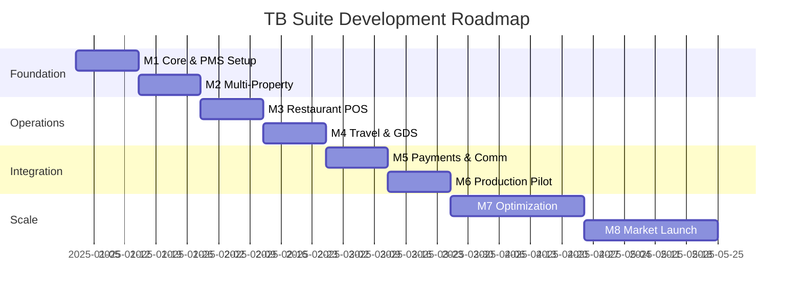
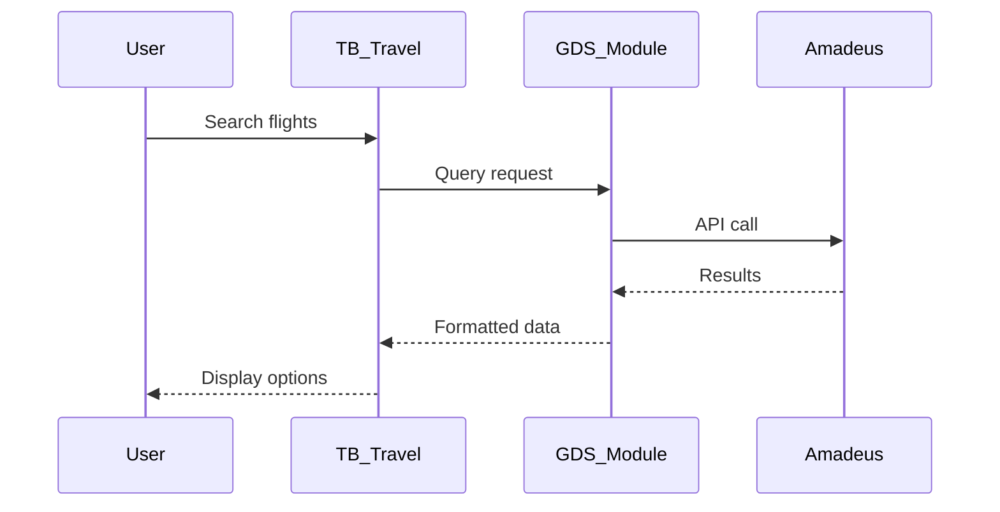

# TB Suite - Development Roadmap

## 🎯 Vision

Transform the hospitality and travel industry with a comprehensive, modular, and scalable platform that replaces legacy systems like Hotelogix and TM-Bill.

## 📅 Milestone Timeline



## 🚀 Detailed Milestones

### Milestone 1: Foundation (Weeks 1-2)
**Goal:** Establish core infrastructure and basic PMS functionality

**Deliverables:**
- [x] Repository structure with tb_* naming
- [x] Documentation framework
- [ ] tb_hotel_core module
  - [ ] Property management
  - [ ] Room and room type setup
  - [ ] Rate plans and pricing
  - [ ] Basic configurations
- [ ] tb_hotel_pms module (basic)
  - [ ] Reservation creation
  - [ ] Check-in/check-out flow
  - [ ] Room assignment
  - [ ] Basic folio management
- [ ] Onboarding wizard MVP
  - [ ] Company setup
  - [ ] Property configuration
  - [ ] Module selection

**Success Criteria:**
- Single property can be configured
- Basic reservation flow works
- Core entities established

---

### Milestone 2: Multi-Property Management (Weeks 3-4)
**Goal:** Enable multi-property and centralized management

**Deliverables:**
- [ ] tb_hotel_management module
  - [ ] Multi-property dashboard
  - [ ] Centralized inventory view
  - [ ] Cross-property reporting
  - [ ] Head office controls
- [ ] Enhanced PMS features
  - [ ] Housekeeping module
  - [ ] Night audit procedures
  - [ ] Guest history
  - [ ] Tape chart view
- [ ] tb_channel_bridge scaffold
  - [ ] STAAH integration design
  - [ ] Basic rate/inventory sync
  - [ ] Booking download structure

**Success Criteria:**
- Can manage 3+ properties from single login
- Centralized reporting works
- STAAH integration documented

---

### Milestone 3: Restaurant Operations (Weeks 5-6)
**Goal:** Complete F&B management system

**Deliverables:**
- [ ] tb_restaurant_pos module
  - [ ] Table management
  - [ ] Order taking interface
  - [ ] KOT generation and routing
  - [ ] Bill generation and splitting
  - [ ] Payment processing
  - [ ] Cashier reconciliation
- [ ] tb_restaurant_management module
  - [ ] Menu engineering
  - [ ] Recipe management
  - [ ] Ingredient tracking
  - [ ] Cost calculations
  - [ ] Vendor management
  - [ ] Stock control

**POS User Interface:**
```
TODO: add screenshot - POS terminal interface
TODO: add screenshot - Kitchen display system
TODO: add screenshot - Manager dashboard
```

**Success Criteria:**
- Complete order-to-payment flow
- Kitchen operations integrated
- Inventory tracking functional

---

### Milestone 4: Travel & GDS Integration (Weeks 7-8)
**Goal:** Enable travel booking and GDS connectivity

**Deliverables:**
- [ ] tb_travel_management module
  - [ ] Travel request workflow
  - [ ] Itinerary builder
  - [ ] Package creation
  - [ ] Corporate policies
  - [ ] Credit management
- [ ] tb_gds_integrations module
  - [ ] Amadeus API integration
  - [ ] Flight search and booking
  - [ ] PNR management
  - [ ] Ticket issuance
  - [ ] Fare calculation
  - [ ] Queue management

**Integration Flow:**


**Success Criteria:**
- Live Amadeus connection works
- Can book and issue tickets
- Corporate credit profiles functional

---

### Milestone 5: Payments & Communication (Weeks 9-10)
**Goal:** Integrate payment gateways and communication channels

**Deliverables:**
- [ ] Payment Gateway Integration
  - [ ] Razorpay integration
  - [ ] Payment link generation
  - [ ] Refund processing
  - [ ] Settlement reconciliation
  - [ ] Multi-currency support
- [ ] Communication Channels
  - [ ] Exotel telephony
  - [ ] WhatsApp Business API
  - [ ] SMS notifications
  - [ ] Email templates
  - [ ] Guest communication log
- [ ] Enhanced Dashboards
  - [ ] Executive dashboard
  - [ ] Revenue analytics
  - [ ] Occupancy forecasting
  - [ ] Performance metrics

**Notification Triggers:**
```yaml
Reservation:
  - Confirmation SMS/Email
  - Pre-arrival reminder
  - Check-in instructions
  - Thank you message

Payment:
  - Payment receipt
  - Refund notification
  - Payment reminder

Housekeeping:
  - Room ready alert
  - Maintenance required
```

**Success Criteria:**
- Payments process successfully
- Notifications delivered reliably
- Dashboards provide actionable insights

---

### Milestone 6: Production Pilot (Weeks 11-12)
**Goal:** Deploy to production and replace legacy systems

**Deliverables:**
- [ ] Production Environment
  - [ ] Server setup and hardening
  - [ ] Database optimization
  - [ ] Load balancing configuration
  - [ ] Backup strategies
  - [ ] Monitoring setup
- [ ] Data Migration
  - [ ] Guest database import
  - [ ] Reservation history
  - [ ] Rate plans and contracts
  - [ ] Financial data
  - [ ] User accounts
- [ ] Training & Documentation
  - [ ] User training videos
  - [ ] Operation manuals
  - [ ] API documentation
  - [ ] Troubleshooting guides
- [ ] Go-Live Support
  - [ ] 24/7 support setup
  - [ ] Issue tracking system
  - [ ] Performance monitoring
  - [ ] Feedback collection

**Migration Checklist:**
```
Pre-Migration:
□ Backup existing data
□ Test migration scripts
□ Train key users
□ Prepare rollback plan

Migration:
□ Import master data
□ Import transactional data
□ Verify data integrity
□ Configure integrations

Post-Migration:
□ Verify all functions
□ Monitor performance
□ Collect feedback
□ Optimize based on usage
```

**Success Criteria:**
- Successfully replace Hotelogix at 1 property
- Successfully replace TM-Bill at 1 restaurant
- Zero data loss during migration
- User adoption > 80%

---

### Milestone 7: Optimization & Enhancement (Months 4-5)
**Goal:** Optimize performance and add advanced features

**Deliverables:**
- [ ] Performance Optimization
  - [ ] Query optimization
  - [ ] Caching strategies
  - [ ] CDN implementation
  - [ ] Mobile app development
- [ ] Advanced Features
  - [ ] AI-powered pricing
  - [ ] Predictive analytics
  - [ ] Voice commands
  - [ ] IoT integration
- [ ] Additional Modules
  - [ ] tb_billing completion
  - [ ] tb_crm_reservations completion
  - [ ] Loyalty program
  - [ ] Marketing automation

**Success Criteria:**
- Page load time < 2 seconds
- 99.9% uptime achieved
- Advanced features adopted
- Customer satisfaction > 90%

---

### Milestone 8: Market Launch (Month 6)
**Goal:** Full market release and scaling

**Deliverables:**
- [ ] Marketing Website
- [ ] SaaS Platform
- [ ] Partner Program
- [ ] App Marketplace
- [ ] Certification Program
- [ ] 24/7 Support System

**Go-to-Market Strategy:**
```
Target Segments:
1. Independent Hotels (1-50 rooms)
2. Boutique Chains (2-10 properties)
3. Restaurant Groups
4. Travel Agencies

Pricing Tiers:
- Starter: ₹5,000/month
- Professional: ₹15,000/month
- Enterprise: Custom

Launch Channels:
- Direct sales
- Partner network
- Online marketplace
- Industry events
```

**Success Criteria:**
- 50+ customers onboarded
- ₹10L+ MRR achieved
- 95% customer retention
- 4.5+ star rating

---

## 📊 Key Performance Indicators

### Technical KPIs
| Metric | Target | Current |
|--------|--------|---------|
| System Uptime | 99.9% | - |
| API Response Time | <200ms | - |
| Page Load Time | <2s | - |
| Database Query Time | <100ms | - |
| Error Rate | <0.1% | - |

### Business KPIs
| Metric | Target | Current |
|--------|--------|---------|
| Properties Onboarded | 100 | 0 |
| Monthly Active Users | 1000 | 0 |
| Transaction Volume | 100K/month | 0 |
| Customer Satisfaction | >90% | - |
| Churn Rate | <5% | - |

### Development KPIs
| Metric | Target | Current |
|--------|--------|---------|
| Code Coverage | >80% | - |
| Sprint Velocity | 40 points | - |
| Bug Resolution Time | <24h | - |
| Feature Delivery Rate | 95% | - |
| Documentation Coverage | 100% | - |

## 🎯 Risk Management

### Technical Risks
| Risk | Impact | Mitigation |
|------|--------|------------|
| Scalability issues | High | Load testing, horizontal scaling |
| Integration failures | High | Fallback mechanisms, retry logic |
| Data loss | Critical | Regular backups, replication |
| Security breach | Critical | Security audits, encryption |

### Business Risks
| Risk | Impact | Mitigation |
|------|--------|------------|
| Low adoption | High | User training, onboarding support |
| Competition | Medium | Unique features, better pricing |
| Regulatory changes | Medium | Compliance monitoring |
| Partner dependencies | Medium | Multiple provider options |

## 🔄 Release Schedule

### Version Planning
- **v1.0** - Core + PMS (Month 1)
- **v1.1** - Multi-property (Month 2)
- **v1.2** - Restaurant (Month 2)
- **v1.3** - Travel + GDS (Month 3)
- **v1.4** - Full integrations (Month 3)
- **v2.0** - Production ready (Month 4)
- **v2.1** - Advanced features (Month 5)
- **v3.0** - Market release (Month 6)

### Release Cycle
- **Development:** 2-week sprints
- **Testing:** 1 week per release
- **Staging:** 1 week validation
- **Production:** Monthly releases
- **Hotfixes:** As needed

## 📈 Success Metrics

### Phase 1 Success (Months 1-3)
- ✅ Core modules developed
- ✅ Basic integrations working
- ✅ Pilot customer onboarded
- ✅ Team trained

### Phase 2 Success (Months 4-6)
- ✅ 50+ properties using system
- ✅ All modules production-ready
- ✅ 99.9% uptime achieved
- ✅ Positive customer feedback

### Long-term Success (Year 1)
- ✅ 500+ properties
- ✅ ₹1Cr+ ARR
- ✅ Market leader in segment
- ✅ International expansion ready

---

*TB Suite Roadmap - From vision to reality in 6 months*
