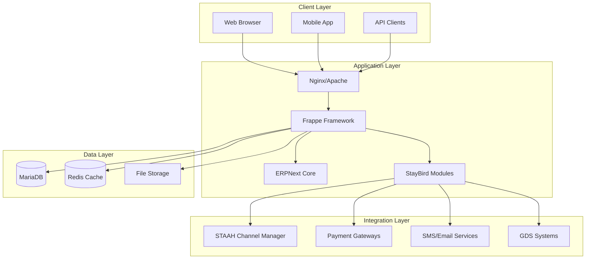

# StayBird Platform - Technical Architecture

## 🏗️ System Architecture Overview



---

## 🎯 Core Components

### 1. Framework Layer

#### Frappe Framework (v15)
- **Purpose:** Core application framework
- **Responsibilities:**
  - Request routing
  - ORM and database abstraction
  - User authentication & authorization
  - Background job processing
  - WebSocket communication
  - REST API generation

#### ERPNext (v15)
- **Purpose:** ERP foundation
- **Modules Used:**
  - Accounts (financial management)
  - Stock (inventory base)
  - CRM (customer management)
  - HR (staff management)
  - Assets (property assets)

### 2. StayBird Modules

#### Module Architecture
```
staybird_[module]/
├── [module_name]/
│   ├── __init__.py
│   ├── hooks.py           # Module configuration
│   ├── modules.txt        # Module listing
│   ├── patches/           # Database migrations
│   ├── doctype/           # Business entities
│   ├── page/              # Single-page apps
│   ├── report/            # Business reports
│   ├── print_format/      # Print templates
│   ├── workflow/          # Business workflows
│   ├── web_form/          # Public forms
│   └── api/               # Custom APIs
├── setup.py               # Package configuration
├── requirements.txt       # Dependencies
└── README.md             # Documentation
```

#### Module Dependencies


---

## 💾 Data Architecture

### Database Schema

#### Core Entities
```sql
-- Property Management
├── Property
│   ├── property_code (PK)
│   ├── property_name
│   ├── address
│   └── configuration
│
├── Room
│   ├── room_number (PK)
│   ├── property (FK)
│   ├── room_type (FK)
│   └── status
│
├── Reservation
│   ├── reservation_id (PK)
│   ├── guest (FK)
│   ├── room (FK)
│   ├── check_in_date
│   ├── check_out_date
│   └── status
│
├── Guest
│   ├── guest_id (PK)
│   ├── personal_details
│   ├── contact_info
│   └── preferences
│
└── Folio
    ├── folio_id (PK)
    ├── reservation (FK)
    ├── charges[]
    └── payments[]
```

### Data Flow


---

## 🔌 Integration Architecture

### Channel Manager Integration (STAAH)
```python
# Connector Pattern Implementation
class STAAHConnector:
    def __init__(self):
        self.base_url = "https://api.staah.com/v1"
        self.auth_token = get_integration_key("staah")
    
    def sync_availability(self, property_id, date_range):
        """Push availability to STAAH"""
        pass
    
    def fetch_bookings(self, last_sync_time):
        """Pull new bookings from STAAH"""
        pass
    
    def update_rates(self, rate_plan, dates):
        """Update rate plans in STAAH"""
        pass
```

### Payment Gateway Integration
```python
# Strategy Pattern for Payment Processing
class PaymentProcessor:
    def __init__(self, gateway):
        self.gateway = self._get_gateway(gateway)
    
    def _get_gateway(self, gateway_type):
        gateways = {
            'razorpay': RazorpayGateway(),
            'stripe': StripeGateway(),
            'paypal': PayPalGateway()
        }
        return gateways.get(gateway_type)
    
    def process_payment(self, amount, currency, metadata):
        return self.gateway.charge(amount, currency, metadata)
```

---

## 🔐 Security Architecture

### Authentication & Authorization
```yaml
Authentication:
  - Type: JWT + Session
  - Token Lifetime: 8 hours
  - Refresh Token: 30 days
  - MFA: Optional (TOTP)

Authorization:
  - Model: RBAC (Role-Based Access Control)
  - Levels:
    - System Admin
    - Property Manager
    - Front Desk
    - Housekeeping
    - Guest

API Security:
  - Rate Limiting: 100 req/min per IP
  - CORS: Configured per environment
  - HTTPS: Enforced in production
  - API Keys: For external integrations
```

### Data Security
```yaml
Encryption:
  - At Rest: AES-256
  - In Transit: TLS 1.3
  - Database: Transparent Data Encryption
  - Files: Encrypted file storage

PII Protection:
  - Masking: Credit cards, SSN
  - Audit Logs: All PII access logged
  - Retention: GDPR compliant
  - Right to Forget: Implemented
```

---

## 🚀 Deployment Architecture

### Development Environment
```yaml
Components:
  - Single server setup
  - SQLite/MariaDB local
  - Redis local
  - Hot reload enabled
  - Debug mode on
```

### Production Environment
```yaml
Components:
  Web Servers:
    - 2x Nginx (Load Balanced)
    - SSL Termination
    
  Application Servers:
    - 3x Gunicorn Workers
    - Supervisor managed
    
  Database:
    - MariaDB Master-Slave
    - Read replicas
    - Automated backups
    
  Cache:
    - Redis Cluster
    - Session storage
    - Queue management
    
  Storage:
    - S3/MinIO for files
    - CDN for static assets
```

### Container Architecture
```dockerfile
# Base Image
FROM frappe/frappe-socketio:v15

# Install StayBird Apps from ekanshjain's repos
COPY apps/ /home/frappe/frappe-bench/apps/
RUN bench get-app https://github.com/ekanshjain/staybird-core.git
RUN bench get-app https://github.com/ekanshjain/staybird-pms.git
# ... other apps from github.com/ekanshjain/

# Configuration
COPY sites/ /home/frappe/frappe-bench/sites/
COPY config/ /home/frappe/frappe-bench/config/

# Entry Point
CMD ["bench", "start"]
```

---

## 📊 Performance Architecture

### Caching Strategy
```python
# Multi-level Caching
CACHE_LEVELS = {
    'L1': 'In-Memory (Application)',  # 10ms
    'L2': 'Redis',                     # 50ms
    'L3': 'Database',                   # 200ms
}

# Cache Keys Pattern
CACHE_KEYS = {
    'property': 'property:{property_id}',
    'availability': 'avail:{property}:{date}',
    'rates': 'rates:{property}:{room_type}:{date}',
    'user_session': 'session:{user}:{session_id}'
}
```

### Database Optimization
```sql
-- Indexes
CREATE INDEX idx_reservation_dates ON reservation(check_in_date, check_out_date);
CREATE INDEX idx_room_status ON room(property, status);
CREATE INDEX idx_folio_date ON folio(creation_date);

-- Partitioning
ALTER TABLE reservation 
PARTITION BY RANGE (YEAR(check_in_date)) (
    PARTITION p2024 VALUES LESS THAN (2025),
    PARTITION p2025 VALUES LESS THAN (2026),
    PARTITION p2026 VALUES LESS THAN (2027)
);
```

### API Performance
```yaml
Optimization Techniques:
  - Response Compression: gzip
  - Pagination: 50 items default
  - Field Filtering: GraphQL-like
  - Batch Operations: Supported
  - Async Processing: Celery queues
  - Connection Pooling: 100 connections
```

---

## 🔄 Scalability Architecture

### Horizontal Scaling


### Microservices Evolution
```yaml
Future Architecture:
  Services:
    - Reservation Service
    - Inventory Service
    - Pricing Service
    - Channel Service
    - Payment Service
    - Notification Service
    - Reporting Service
    
  Communication:
    - REST APIs
    - Message Queue (RabbitMQ)
    - Event Streaming (Kafka)
    
  Service Mesh:
    - Istio for service discovery
    - Circuit breakers
    - Retry logic
```

---

## 📈 Monitoring & Observability

### Monitoring Stack
```yaml
Metrics:
  - Prometheus: Time-series metrics
  - Grafana: Visualization
  - AlertManager: Alert routing

Logging:
  - ELK Stack: Elasticsearch, Logstash, Kibana
  - Structured Logging: JSON format
  - Log Levels: DEBUG, INFO, WARNING, ERROR, CRITICAL

Tracing:
  - Jaeger: Distributed tracing
  - OpenTelemetry: Instrumentation

APM:
  - New Relic / DataDog: Application monitoring
  - Custom Dashboards: Business metrics
```

### Health Checks
```python
# Health Check Endpoints
HEALTH_CHECKS = {
    '/health': 'Basic liveness',
    '/ready': 'Readiness probe',
    '/metrics': 'Prometheus metrics',
    '/status': 'Detailed status'
}

# Example Implementation
@app.route('/health')
def health_check():
    checks = {
        'database': check_database(),
        'redis': check_redis(),
        'storage': check_storage(),
        'integrations': check_integrations()
    }
    
    status = 'healthy' if all(checks.values()) else 'unhealthy'
    return {'status': status, 'checks': checks}
```

---

## 🔄 CI/CD Pipeline

### Pipeline Stages
```yaml
stages:
  - lint:
      - Python: flake8, black
      - JavaScript: eslint
      - SQL: sqlfluff
      
  - test:
      - Unit Tests: pytest
      - Integration Tests: pytest-integration
      - E2E Tests: Cypress
      
  - build:
      - Docker Image Build
      - Asset Compilation
      - Documentation Generation
      
  - deploy:
      - Staging Deployment
      - Smoke Tests
      - Production Deployment
      - Health Checks
```

---

## 📚 Technology Stack Summary

| Layer | Technology | Version | Purpose |
|-------|------------|---------|---------|
| **Frontend** | Vue.js | 3.x | SPA Framework |
| **CSS** | TailwindCSS | 3.x | Utility CSS |
| **Backend** | Python | 3.10+ | Primary Language |
| **Framework** | Frappe | 15.x | Application Framework |
| **ERP** | ERPNext | 15.x | Business Logic |
| **Database** | MariaDB | 10.6+ | Primary Database |
| **Cache** | Redis | 7.x | Caching & Queues |
| **Web Server** | Nginx | 1.24+ | Reverse Proxy |
| **App Server** | Gunicorn | 21.x | WSGI Server |
| **Task Queue** | Celery | 5.x | Async Tasks |
| **Search** | Elasticsearch | 8.x | Full-text Search |
| **Monitoring** | Prometheus | 2.x | Metrics |
| **Container** | Docker | 24.x | Containerization |
| **Orchestration** | Kubernetes | 1.28+ | Container Orchestration |

---

*Last Updated: September 2025*  
*Maintained by: Ekansh Jain ([@ekanshjain](https://github.com/ekanshjain))*  
*Contact: mailme@ekanshjain.com*
